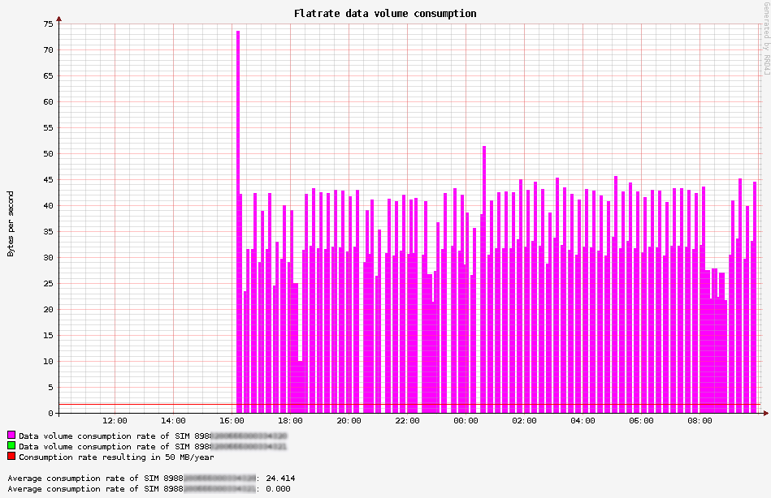

# 1nce-management-api-access-and-rrd4j-graphs
Simple solution to read out NB-IoT data traffic consumption from the 1NCE management API, store it in a round-robin 
database and show the result in a graph.

## Background
[1NCE](https://1nce.com/en/about-1nce/) is an IoT connectivity provider with a disruptive pricing model: 
The company offers a so-called ["IoT Flat Rate"](https://1nce.com/en/pricing/): 
For 10 € you get a SIM card with 10 years lifetime and a flat rate traffic volume of 500 MB and 250 SMS.

As a maker of IoT devices communicating using NB-IoT you now question yourself: 
* Would such a flat rate be sufficient for my use-case? 
* What is the current traffic consumption of my device?
* What effects does it have on the traffic consumption if I change the communication pattern in one or the other way?

Altough some RF modules like the [Quectel BG96](https://www.quectel.com/product/bg96.htm) offer counters to query the number of bytes sent and received, 
which already give a good indication about the traffic consumption, these perhaps don't take into account the traffic on the lower levels of the communication stack, like UDP or TCP.

So why not directly ask 1NCE for the "consumed" traffic volume?

1NCE offers an Application Programming Interface  that allows users to implement the most important functions 
of the Customer Portal into a customer’s environment. The supported functions of the 1NCE API generally enables the customer to manage, control and monitor the 1NCE SIM Cards from an external system.

https://1nce.com/en/help-center/tutorials-documentations/api-functionality/

For example, one can query for a list of SIM cards using a HTTP GET request to

https://api.1nce.com/management-api/v1/sims

... or get information about the left over flat rate traffic volume with a HTTP GET request to

https://api.1nce.com/management-api/v1/sims/my-iccid/quota/data

There is a Swagger UI interface at https://api.1nce.com/management-api/swagger-ui.html that lets you play around 
with the functionality of the Management API.

This example application connects to this Management API, gets the SIM cards and 
creates a [Round-Robin-Database (RRDB)](https://github.com/rrd4j/rrd4j) out of that. Then, the application queries the current traffic consumptions 
of the cards and enters it as sample into the RRDB.

And, as the final goodie, if you navigate to [port 8080](http://localhost:8080) with your web browser, a nice graph with the consumption 
rate of the last 24 hours is displayed.

## How to configure
Put your `client-id` and `client-credentials` in configuration file `application.yml`:

    ok-http-client:
    #  proxy:
    #    host: localhost
    #    port: 3128
    
    1nce:
      client-id: your-client-id
      client-secret: your-client-secret
      token-endpoint: https://portal.1nce.com/management-api/oauth/token

## How to build
You need maven and a Java JDK to compile:

    $ mvn clean package
    
## How to run
    
    $ java -jar target/1nce-management-api-access-and-rrd4j-graphs-0.0.1-SNAPSHOT.jar
    
On the first start, you may see something like this:
    
    ...
    Tomcat started on port(s): 8080 (http) with context path ''
    route=Route{/a.b.c.d:xxxx} response=Response{protocol=http/1.1, code=401, message=, url=https://portal.1nce.com/management-api/v1/sims?page=1&pageSize=100}
    Request did NOT use an Authorization header.
    Requesting a new Access Token by client credentials
    Token endpoint returned status 200 OK and tokens OnceAccessTokenService.Tokens(accessToken=206bed3b-11e6-4253-97c4-cb410f6f08ab, tokenType=bearer, expiresIn=3560, scope=all, appToken=eyJhbGc...)
    QuotaDataResponse(volume=488.29297, totalVolume=500.0, expiryDate=2028-11-20 00:00:00, lastStatusChangeDate=2018-08-20 11:25:03)
    QuotaDataResponse(volume=499.98907, totalVolume=500.0, expiryDate=2028-11-20 00:00:00, lastStatusChangeDate=2018-08-20 11:25:03)
    sample=update "./data-traffic-consumption.rrd" 1573889068:1.2275710689279974E7:11460.935679972172

If a RRDB file with name `data-traffic-consumption.rrd` already exist in the current directory, then it won't be overriden.
If you explicitly want to start with a new RRDB file, start the application with option `--override`.    

## Implementation details
The implementation is done using the Spring Boot framework. 

On startup, it creates a HTTP REST endpoint at port 8080.

Every 5 minutes a task is executed that fetches the current data traffic consumption values for each SIM card
from the 1nce management API and stores it in a round-robin database.
To display the graph, just use your web browser and go to http://localhost:8080 (or wherever you have deployed the application). 

